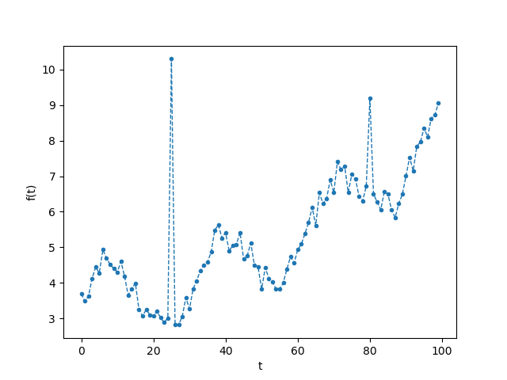

# week4の宿題

- 締切：**2020/10/28 23:59**
- 注意：以下の課題について、元から書いてあるもの以外は`include`してはいけません。
- 解けるぶんだけ解いてください。

## 宿題1：一番目と二番目に大きい値
- `main1.c`を改造し、次のプログラムを書いてください
- 配列の中から、最も大きい数字と、その次に大きい数字を返す関数。その際、ポインタを引数にとることで値を返します。
- 入力集合の個数は2個以上です。
- 入力は自然数（0, 1, 2 ...）の集合です。数字に被りが生じた場合は、被りを除去してください。
- second_largestが存在しないときは-1を返してください


### 実行コマンドと想定出力
```bash
$ gcc main1.c -o main1
$ ./main1 9 3 8 2 13 7 13 23 
largest: 23
second_largest: 13
$ ./main1 4 4 4 3 3 
largest: 4
second_largest: 3
$ ./main1 5 5 5 
largest: 5
second_largest: -1
$ ./main1 10 10
largest: 10
second_largest: -1
$ ./main1 2 3
largest: 3
second_largest: 2
```


## 宿題2：1次元medianフィルタ
- `main2.c`を改造し、次のプログラムを書いてください
- 1次元の[medianフィルタ](https://en.wikipedia.org/wiki/Median_filter)を書いてください。medianフィルタとは、ノイズがのった信号をスムースにする処理です。特に、ペッパーノイズと呼ばれる、急にピークが立つタイプの外れ値を除去してくれます。
- 例：離散信号 x = [3, 2, 50, 5, 6, 3] を考えます。xの入力に対して、幅が3のmedianフィルタを適用することを考えます。それにより、ノイズを除去した信号yが得られます。yはxと同じ長さです。yの各要素は、次の3つの値の中央値（median）になります。(1) 対応するxの要素（x(t)とします）、(2) 一個前（x(t-1)）、(3) 一個後（x(t+1)）。すなわち、以下のようになります
    - y(0) = median( x(0), x(0), x(1) ) = median(3, 3, 2)  = 3
    - y(1) = median( x(0), x(1), x(2) ) = median(3, 2, 50) = 3
    - y(2) = median( x(1), x(2), x(3) ) = median(2, 50, 5) = 5
    - y(3) = median( x(2), x(3), x(4) ) = median(50, 5, 6) = 6
    - y(4) = median( x(3), x(4), x(5) ) = median(5, 6, 3)  = 5
    - y(5) = median( x(4), x(5), x(5) ) = median(6, 3, 3)  = 3
- よって、y = [3, 3, 5, 6, 5, 3]
- ここで、端の値（y(0)およびy(5)）については、要素を３つ取れないので、端を一個コピーして使いました。
- 源信号xでは50というノイズがのっていたのですが、それが除去されてスムースな信号になっていることがわかります。
- 実際の例を次のように`signal.png`に示します。また、その具体的な数値を`signal.txt`に示します。ここでは、x(0) の値が一行目に、x(1)が二行目に、と続き、x(99)が100行目に書いてあります。ここでは、二か所にノイズがあることがわかります。
  


### 準備
まず、信号の可視化のための補助pythonスクリプトがありますので、それを実行してみましょう。
repl.itを使っている人は、`vis.py`, `signal.txt`をrepl.it上にコピーしたうえで、以下を実行してください。
```bash
$ python vis.py --signal signal.txt --img signal2.png
```
- このスクリプトは`signal.txt`の情報を読み取り、可視化し、`signal2.png`に吐き出してくれます。ここでは、`signal2.png`は`signal.png`と同じになるはずです。
- このスクリプトを実行するためにはpythonが必要です。repl.itではうまくいくはず（最初に実行したときにはセットアップに時間がかかるみたいです）ですが、ローカルだとうまくいかないかもしれません。その場合はローカルにpythonをいれる（anacondaがオススメです）か、repl.itで試してください。

### 実行コマンドと想定出力

動作確認：signal_test.txtをrepl.itにコピーしてください
```bash
$ gcc main2.c -o main2
$ ./main2 <signal_test.txt
1.000000
2.000000
2.000000
 ... ここに2.000000がずっと並ぶ
2.000000
2.000000
1.000000
```

本番
```bash
$ gcc main2.c -o main2
$ ./main2 <signal.txt >smooth_signal.txt
```
こうすることで、medianフィルタを適用した結果のsmooth_signal.txtが生成されます。

これを可視化するには以下を実行します。これにより、smooth_signal.pngが生成されます。
ペッパーノイズが消えていることを確認しましょう。もしこの画像がおかしければ、
実装の何かを間違えています。
```bash
$ python vis.py --signal smooth_signal.txt --img smooth_signal.png
```


## 宿題3：文字置換
- `main3.c`を改造し、次のプログラムを書いてください
- 単純文字置換アルゴリズムを書いてください。例えば次のような文字列が与えられたとします。

    - `s[N] = "abcde";`
    - `old[N] = "bc";`
    - `new[N] = "xxx";`

  ここで、`s`中で`old`にマッチする部分を、`new`に置き換えてください。すなわち、ここでは`s`は`"axxxde"`になります。
- ここで、文字配列の長さ`N`は十分に長いとします（それに関する境界条件は考慮しなくていいです）
- `s`, `old`, `new`それぞれについて、文字数は1以上とします。つまり、入力が空白であることはないです。
- 複数回マッチしたときは、毎回置換してください。
- マッチしないときは、元の`s`のままにしてください。
- `include <string.h>`してはいけませんが、必要に応じて、授業で扱った文字列操作関数を自由にコピーして使ってもいいです。


### 実行コマンドと想定出力
```bash
$ gcc main3.c -o main3
$ ./main3 tokyo_univ tokyo kyoto
s="tokyo_univ", old="tokyo", new="kyoto"
Before: tokyo_univ
After: kyoto_univ
$ ./main3 zensyutyu_no_kokyu zensyutyu hamon
s="zensyutyu_no_kokyu", old="zensyutyu", new="hamon"
Before: zensyutyu_no_kokyu
After: hamon_no_kokyu
$ ./main3 ramen raen soba
s="ramen", old="raen", new="soba"
Before: ramen
After: ramen
$ ./main3 abcdef cde xxxx
s="abcdef", old="cde", new="xxxx"
Before: abcdef
After: abxxxxf
$ ./main3 piyopiyo iyo oge
s="piyopiyo", old="iyo", new="oge"
Before: piyopiyo
After: pogepoge
```

### 発展課題
以下のように、s, old, newに被りがあるパターンも対応してください
```bash
$ ./main3 aaaaa aa a
s="aaaaa", old="aa", new="a"
Before: aaaaa
After: aaa
$ ./main3 aaaaa aa aaa
s="aaaaa", old="aa", new="aaa"
Before: aaaaa
After: aaaaaaa
```

